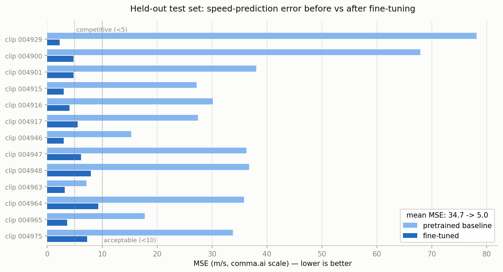
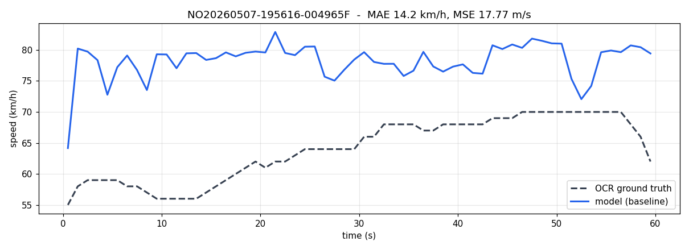
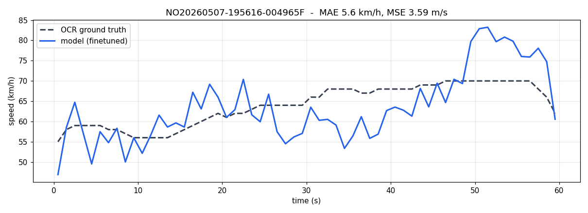
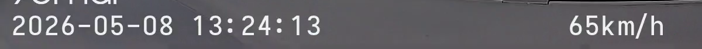

# Dashcam Speed Estimator (optical flow + CNN)

This estimates the speed of the vehicle that a **dashcam is mounted on**, straight
from the video. No vanishing points, no camera calibration, no 3D geometry.

How it works: for each pair of consecutive frames we measure how the pixels move
(that's *optical flow*), and a small neural network turns that motion into a speed
number. It's the same idea as the [comma.ai Speed Challenge](https://github.com/commaai/speedchallenge).

**Two sets of weights are included:**

| Weights | What it is |
|---|---|
| `weights/Model.pt` | pretrained on comma.ai data — works anywhere, roughly |
| `weights/finetuned.pt` | **fine-tuned on our 70mai dashcam** — the one to use |

## Results (held-out test set)

We fine-tuned on 47 one-minute clips from our 70mai dashcam and tested on 13
clips from the *same drives but never seen in training*. Errors are against GPS
ground truth read from the video overlay (see below). Fine-tuning cut the mean
error about **7×** — from "unusable" to **competitive** on the comma.ai scale:



| Test set (13 clips) | Pretrained | Fine-tuned |
|---|---|---|
| MSE (m/s, comma.ai scale) | 34.7 | **4.99** |
| Mean abs. error | 16.5 km/h | **6.4 km/h** |
| Verdict (comma.ai bars) | needs fine-tuning | **competitive** |

Every one of the 13 test clips improved; the worst clip is at 9.3 MSE (still
under the "acceptable" bar of 10), the best at 2.3 ("exceptional" is under 3).
A typical clip, before and after:




## Setup (once)

You need Python 3.9 or newer. Copy-paste the block for your machine.

Windows (PowerShell):
```powershell
python -m venv .venv
.\.venv\Scripts\Activate.ps1
pip install -r requirements.txt
```

macOS / Linux:
```bash
python3 -m venv .venv
source .venv/bin/activate
pip install -r requirements.txt
```

## Run it on a video

```bash
python predict_speed.py --video path/to/your_dashcam.mp4 --weights weights/finetuned.pt
```

You get two files in `outputs/`: `<name>_speeds.csv` (the speed at every frame,
m/s and mph) and `<name>_speed.png` (a speed-over-time chart). Drop the
`--weights` flag to use the generic pretrained model instead.

## The full pipeline (how the results above were produced)

### 1. Ground truth for free: OCR the GPS overlay (`extract_gt.py`)

70mai dashcams burn the GPS speed into every frame. We read it back out and use
it as training labels — no manual labeling, no OBD cable:



No OCR engine is needed: the overlay uses a fixed bitmap font, and the timestamp
text is fully predictable, so the script *learns* the ten digit shapes from the
timestamp itself and then reads the speed field by template matching. On a fixed
font this is essentially exact. Details that matter in practice:

- **`--template-cache`**: digit templates learned from a long clip are cached and
  reused (after verifying them against the clip's known date digits). Needed for
  short 30 s event clips, whose clock doesn't cycle through all ten digits.
- **Glare filter**: bright scenery bleeding through the semi-transparent overlay
  can leave blobs left of the speed digits; only the right-aligned digit group is
  read, so those blobs can't become a junk leading digit.
- Readings are majority-voted across 5 frames per second (GPS updates at 1 Hz),
  then impossible jumps are interpolated.

```bash
python extract_gt.py --video ../dashcam_videos/NO2026...F.MP4 --template-cache ../outputs/digit_templates.npz
```

Outputs per video: `<name>_gt.csv` (per-second speeds), `<name>_gt_ms.txt`
(one speed in m/s per frame — the label format `finetune.py` expects).

### 2. Batch extraction + train/test split (`batch_extract_gt.py`)

Runs `extract_gt.py` over every video and organizes the dataset:

```bash
python batch_extract_gt.py    # reads "../Dashcam Videos", writes ../outputs
```

- Clips are grouped into **drive sessions** (consecutive clips of the same
  drive), and the last ~20% of each session becomes the test set. A random split
  would put adjacent minutes of the same road in both sets and inflate scores.
- Each video gets a folder under `outputs/train/` or `outputs/test/` holding the
  video copy, `_gt.csv`, `_gt.xlsx`, and `_gt_ms.txt`; `split_manifest.csv`
  indexes everything. Resumable — re-running skips finished videos.
- Clips whose overlay shows `--km/h` (no GPS fix yet) fail cleanly and are
  excluded — there is no ground truth to extract.

### 3. Fine-tune (`finetune.py`)

```bash
python finetune.py --manifest ../outputs/train_manifest.txt --stride 3 --epochs 15 --cache outputs/flow_cache_s3
```

- **`--stride 3`** matters: the camera records 60 fps but the model was trained
  on 20 fps optical flow, so training uses every 3rd frame to match the flow
  magnitudes that `predict_speed.py` (which resamples to 20 fps) will produce.
- Flow images are cached on disk and reused across runs; the model checkpoints
  to `weights/finetuned.pt` **after every epoch**, so a crash never loses
  progress.
- Frames from all videos are pooled; 20% is held out as validation. Our run:
  validation MSE fell from 15.7 (epoch 1) to 6.7 (epoch 15).

### 4. Evaluate on the held-out split (`eval_split.py`)

```bash
python eval_split.py --split test --tag finetuned --weights weights/finetuned.pt
```

The model predicts 20×/second but GPS truth updates 1×/second, so predictions
are averaged within each second and compared at 1 Hz. Per video it writes a
GT-vs-prediction plot and adds `<tag>_pred_kmh` / `<tag>_error_kmh` columns to
the video's Excel sheet; per run it writes `outputs/eval_<tag>_<split>.csv` and
prints MAE / MSE per clip and overall.

## Files

| File | What it is |
|------|------------|
| `predict_speed.py` | main script, run a video and get speeds |
| `pipeline.py` | optical-flow and inference core |
| `model.py` | the CNN definition |
| `extract_gt.py` | ground-truth speed from the 70mai GPS overlay (OCR-free OCR) |
| `batch_extract_gt.py` | run extract_gt over all videos + train/test split |
| `finetune.py` | adapt the model to your camera |
| `eval_split.py` | score weights against the GPS truth per split |
| `compare_gt.py` | older per-clip GT comparison (interval tables) |
| `weights/Model.pt` | pretrained weights (comma.ai data) |
| `weights/finetuned.pt` | fine-tuned on our 70mai data — **use this one** |

## Notes and limits

- Speeds are m/s in the CSVs (mph/km/h columns included where relevant).
- The fine-tuned weights are calibrated to *this* camera (70mai, 1080p, 60 fps,
  windshield mount). A different camera or mounting → run steps 1–4 again.
- Videos (`*.mp4`) are gitignored; only code, weights, and small results are
  tracked.

## Credits

Model architecture and pretrained weights adapted from Yash Shah's comma.ai
speed-challenge solution: https://github.com/shahyash10/speedchallenge
